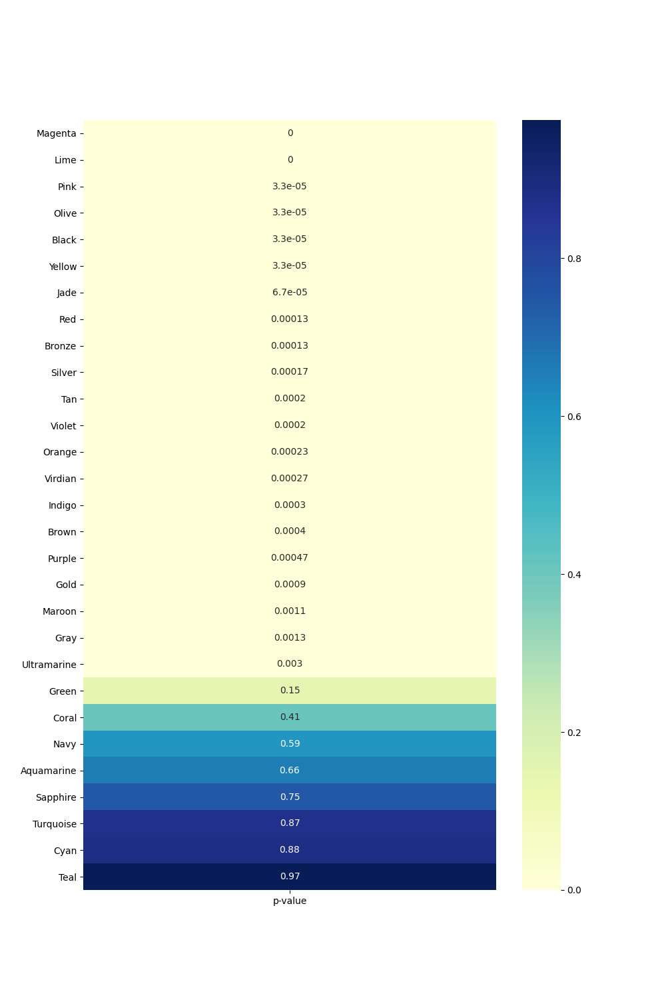

# Advert Analysis Project

## Prerequisites
1. Pandas
1. Numpy
1. Seaborn
1. Matplotlib.pyplot
1. Click

## Getting Started
To make the necessary packages available, we can either install requirements:

    pip install -r requirements.txt

or run:

    pipenv shell

We can then run our **main()** function from the command line by running:

    src/main.py --file_path data/colored_ad_click_table.csv

## Intro
Over the course of 30 days, a business owner advertises his business online. The text of every advertisement is assigned to one of 30 possible colours. The ads are distributed evenly by colour, with 100 of each different colour being viewed daily. These numbers add up to 3,000 daily views that are distributed across the 30 colours. The businesses advertising software automatically tracks all daily views. It also records the daily clicks associated with each of the 30 colours. The software stores this data in a csv table, which holds the clicks-per-day and views-per-day for every specified colour.

We are tasked with finding out if there is a text colour that will render a higher number of clicks than the current colour used by the business, blue. We must find out if there is a colour that generated a higher daily click count mean and then compare it to the daily click means of the adverts in blue, determining if the difference in means is statistically significant through the use of statistical hypothesis testing.

## main() Function:
Arguments:
- ***file_path*** (required):
    - File path for csv file to be fed into **clicks_csv_to_dataframe**, which loads the csv file into a dataframe, *df*.
- ***permutations*** (default=30,000):
    - Determines the number of permutations used in our permutation tests.
    - Can be changed from default by including the permutations option with an integer when calling main.py from the command line.
    - Fed into **find_significant_colours**, which is used to determine if there are any colours that produce a higher number of clicks.
- ***heatmap***:
    - If we include the heatmap option when calling main.py in the command line, then the **generate_heatmap** function is initiated, generating a heatmap of the p-value for each colour paired with blue.

### csv_clicks_to_dataframe
- Required function in **main()**.
- Loads the csv, specified by *file_path*, into a dataframe.
- Minimizes the amount of unnecessary information in the new dataframe:
     - Removes columns containing view counts, as the view count for each colour is 100 daily without exception.
    - The column listing the different colours is set to act as the row indices for the dataframe.
- The returned dataframe, *df*, is an argument to both the **find_significant_colours** and **generate_heatmap** functions.

### find_significant_colours
- Primary function in **main()**.
- Finds colours that perform better than the blue coloured adverts.
- Arguments:
    - ***df***: fed in from **clicks_csv_to_dataframe**.
    - ***permutations***: fed in from the second argument in the **main()** function.
- Contains a sequence of functions that have the arguments *df* and *permutations* fed through both of them.

#### permutation_test:
- A statistical significance test used to find the associated p-value of two separate sample means when population mean and variance are unknown.
    - The number of permutations used for the test is determined by *permutations*, passed in from **main()**.
- Returns the p-value computed from the mean click counts for blue and another colour, specified by the argument *colour_clicks*.
- These p-values will be used to test the null hypothesis that the two datasets are from the same population. If the samples come from the same population, then this indicates the difference in daily click means occurred by chance.

#### superior_click_colour_p_values:
- Filters out all of the colours that have inferior daily mean click counts to blue.
- Iterates through the remaining colours, collecting the relevant p-value in relation to the blue advert clicks using the **permutation_test** function.
- Returns a colour to p-value dictionary (*colour_p_value_dict*).

#### Bonferroni correction
- The final process: carried out in the main body of the **find_significant_colours** function.
- A process used to counteract the effects of data dredging:
    - When oversampling leads to a statistically significant p-value being computed that may be false or misleading.
- The standard significance level is 0.05: a p-value lower than 0.05 is considered to show statistical significance.
- The Bonferroni correction divides the significance level by the number of permutation tests that have been carried out:
    - Our function determines the new significance level by dividing 0.05 by the number of colours in *colour_p_value_dict*.
- Iterates through colours in *colour_p_value_dict*: if a colour's p-value is below the new significance level, the colour and associated p-value are added to a dictionary, *significant_colours*, which is then returned.

### generate_heatmap
- Optional function in **main()**.
- Uses the *colour_p_value_dict* returned by **collect_p_values** (described below).
- Sorts the colour and p-value pairs in *colour_p_value_dict* by their p-values.
- Generates a heatmap of the sorted p-values for each of the colours in the csv file, asides blue.

#### collect_p_values
- Iterates through each different colour in the dataframe (except blue), collecting the relevant p-value in relation to the blue advert clicks using the **permutation_test** function.
- Returns a colour to p-value dictionary (*colour_p_value_dict*), listing each colour in the dataframe along with its associated p-value.

## Results
The *significant_colours* dictionary returned by **find_significant_colours** is a list that contains the colours that we've shown, through statistical hypothesis testing, to improve the performance of the businesses adverts. This will be a list of colours that have a higher mean click count than blue as well as a p-value that shows statistical significance.
When we run our **main()** function, we are returned only one colour, Ultramarine, with a p-value of roughly 0.0025. Our findings would strongly suggest that the business owner should change his advertising text colour to Ultramarine in order to improve the number of clicks his adverts receive.

### P-Value Heatmap

|:--:|
| *P-Value Heatmap computed with permutations=30000* |

This heatmap shows us that a large number of the 29 colours have very low p-values, suggesting they have statistically significant differences in mean daily clicks in comparison to blue, although this doesn’t necessarily mean that these colours have performed better.
Our **find_significant_colours** function found that of all the colours with sufficiently low p-values to suggest significance, only Ultramarine had a higher mean click count than blue, meaning the other colours with low p-values must have had a lower mean daily click count than blue.
The statistically significant p-values as well as inferior mean click counts indicate that roughly 19 of the 29 colours would have diminished the efficacy of the advertising, suggesting blue was already a colour that was consistently producing relatively high clicks per view compared to many of the other colours.
